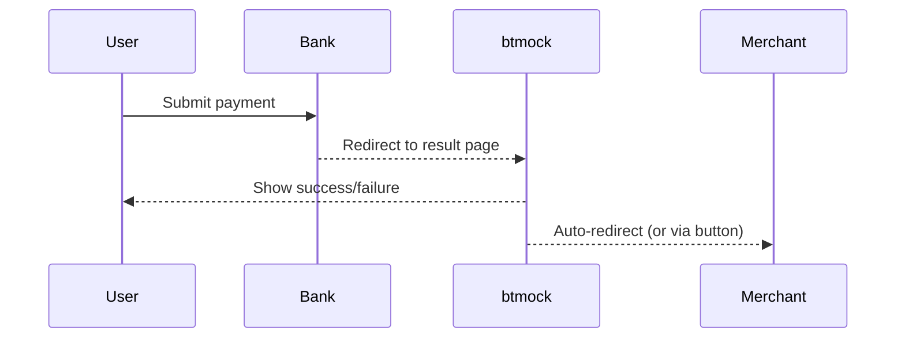

# btmock

## Project Overview

**btmock** is a lightweight web platform designed to **simulate the final stages of a payment flow**, specifically the post-transaction result screen that a user would see after being redirected from a bank or payment processor. Its primary purpose is to support **end-to-end integration testing** of payment handling flows, with a focus on:

* Displaying payment success or failure messages in a web UI
* Redirecting back to the merchant after a simulated result
* Emulating common **bank-side error responses and statuses**
* Validating how frontends handle edge cases like expired cards, incorrect CVV, or unavailable PSPs

This is not a real payment processor—it is a **mock result frontend**, helping teams test redirect-based flows and **verify integration robustness** without hitting real banking systems.

## Quick Start

1. **Prerequisites:** Java 17+, Maven 3.9+
2. **Clone and Run in Dev Mode:**

   ```bash
   git clone https://github.com/QuirkyTurtle27/btmock.git
   cd btmock
   mvn clean install quarkus:dev
   ```
3. **Access App:** Open [http://localhost:8080](http://localhost:8080) in your browser.

## Features

* JSF-based result screens (PrimeFaces UI) for:

  * **Payment Success**
  * **Payment Failure**
* Auto-redirect to merchant return URL (configurable)
* Customizable failure reasons (e.g. `invalid expiry date`, `insufficient funds`)
* Displays test metadata:

  * Card masked PAN, expiration, cardholder name
  * Transaction timestamp and amount
  * Merchant name and description

## Technologies Used

* **Quarkus 3** – Cloud-native Java framework optimized for fast startup and low memory usage. Used here to power the backend application logic, dependency injection, and configuration handling.
* **Jakarta EE (CDI, Faces, JPA)** – Core Java EE APIs used for defining beans, lifecycle management, and (optionally) persistence. CDI is used to wire backing beans and services cleanly.
* **PrimeFaces 15** – Rich UI component library for JSF. Used for rendering result screens with styled components like panels, buttons, messages, and icons.
* **Jakarta Faces (JSF)** – Component-based UI framework. Enables server-side rendering of XHTML views. JSF pages are linked to managed beans (`@Named`) that control logic and hold state.
* **H2 (or Quarkus Dev Services)** – In-memory development database support, if needed for storing simulated transaction state.
* **Maven** – Build and dependency management tool. Used to compile, package, and run the application.
* **Quarkus PrimeFaces Extension (quarkiverse)** – Allows JSF (Apache MyFaces) to run natively inside Quarkus, enabling seamless integration between JSF UI and modern backend services.

## Architecture

* **Front-end:** PrimeFaces (Facelets/XHTML)
* **Back-end:** Quarkus 3 (Jakarta EE 10, CDI, JPA)
* **Persistence:** H2 or dev-services-based temporary storage
* **Display Flow:** Based on a `paymentResultBean`, which injects simulated values and controls redirect logic



## Configuration

Edit `src/main/resources/application.properties`:

```properties
quarkus.http.port=8080
payment.merchant.return-url=http://merchant.local/return
```

To simulate different outcomes, extend `paymentResultBean` logic or add query parameters to mock various errors.

## Development Tips

* Run in dev mode with hot reload: `mvn quarkus:dev`
* Debug on port `5005`
* Use PrimeFaces `p:commandButton`, `p:panel` for visual feedback
* Customize error text, icons, and transaction display

## Testing Scenarios

Use btmock to validate how your integration handles:

* Failed payment redirects (with messages)
* Success confirmations with transaction metadata
* Browser-based return flows from banks
* Edge cases: expired card, network error, invalid signature

## ADR Notes

This project uses a layered CDI structure and Quarkus Dev Services to remain lightweight and fast. Decisions around using Quarkus + PrimeFaces instead of SPA frameworks are recorded in `/docs/adr/` (if maintained).
